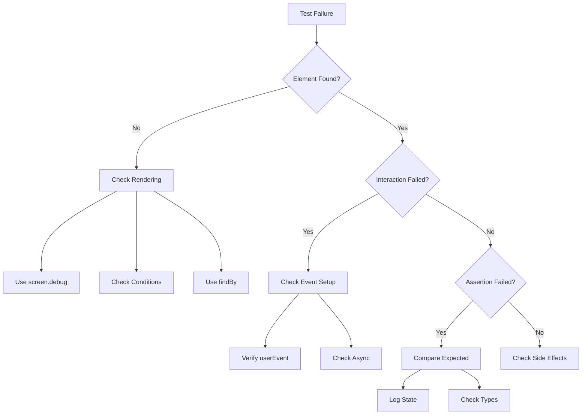

# Unit Testing Guide

## Goal
Our goal is to write tests that work correctly on the first attempt by:
1. Thoroughly understanding the component's implementation before writing any tests
2. Being familiar with testing library syntax and patterns
3. Understanding UI library (e.g., Radix UI) testing requirements
4. Following a systematic approach to test writing
5. Ensuring tests are maintainable and reflect real user behavior

## Pre-Testing Analysis Checklist

### Component Architecture Review
- [ ] Review component's file structure and dependencies
- [ ] Understand component's role in the application
- [ ] Map data flow (props, state, context)
- [ ] Identify integration points with other components
- [ ] Review component's TypeScript interfaces/types
- [ ] Understand component's lifecycle
- [ ] Document component's responsibilities
- [ ] Identify potential refactoring needs

### State Management Analysis
- [ ] Document all state variables and their purposes
- [ ] Map state transitions and side effects
- [ ] Identify optimistic updates and loading states
- [ ] Understand error state handling
- [ ] Review state initialization
- [ ] Document state dependencies
- [ ] Map async state updates
- [ ] Identify state persistence requirements

### UI/UX Flow Analysis
- [ ] Map all possible user interaction paths
- [ ] Document expected behavior for each interaction
- [ ] List all visual states and transitions
- [ ] Identify accessibility requirements
- [ ] Document keyboard navigation flows
- [ ] Map focus management requirements
- [ ] List animation states and triggers
- [ ] Document responsive behavior

### Technical Dependencies
- [ ] List all external libraries used
- [ ] Document UI framework-specific features
- [ ] Note any custom hooks or utilities
- [ ] Identify performance considerations
- [ ] List required providers
- [ ] Document API dependencies
- [ ] Map WebSocket interactions
- [ ] Review build dependencies

## Best Practices

### 1. Component Analysis
- Read and understand the component's source code completely before writing tests
- Identify key functionality and state management
- Note any hooks being used and their impact on testing
- Identify visual states and transitions
- Check for accessibility features
- Understand component hierarchy and parent-child relationships
- Review event handlers and their side effects
- Map out component's data flow and state changes

### 2. Test Setup
- Mock hooks properly using jest.mock with requireActual for partial mocks
- Clear mocks between tests using beforeEach
- Set up default mock implementations that match expected behavior
- Use data-testid attributes strategically and sparingly
- Keep test descriptions clear and behavior-focused
- Ensure proper test isolation
- Mock complex UI libraries (e.g., framer-motion) appropriately
- Handle asynchronous operations correctly

### 3. Test Organization
- Group related test cases logically
- Test both initial and state-dependent rendering
- Verify accessibility attributes and ARIA states
- Check visual indicators and state changes
- Test disabled states and user interactions
- Ensure proper cleanup between tests
- Test error states and edge cases
- Verify component integration points

## Testing Templates

### Radix UI Components
```typescript
describe('RadixComponent', () => {
  // Standard setup
  const renderComponent = (props = {}) => {
    return render(
      <RadixProvider>
        <Component {...defaultProps} {...props} />
      </RadixProvider>
    );
  };

  // Standard test cases
  it('renders in default state', () => {
    renderComponent();
    expect(screen.getByRole('button')).toHaveAttribute('aria-expanded', 'false');
  });

  it('handles user interactions', async () => {
    const user = userEvent.setup();
    renderComponent();
    
    // Standard interaction pattern
    const trigger = screen.getByRole('button');
    await user.click(trigger);
    
    // Standard assertions
    expect(trigger).toHaveAttribute('aria-expanded', 'true');
    expect(screen.getByRole('dialog')).toBeInTheDocument();
  });
});
```

### Next.js Components
```typescript
describe('NextjsComponent', () => {
  const mockRouter = {
    push: jest.fn(),
    replace: jest.fn(),
    prefetch: jest.fn(),
    query: {},
  };

  beforeEach(() => {
    jest.clearAllMocks();
    (useRouter as jest.Mock).mockReturnValue(mockRouter);
  });

  const renderComponent = (props = {}) => {
    return render(
      <SessionProvider>
        <Component {...defaultProps} {...props} />
      </SessionProvider>
    );
  };

  it('handles navigation correctly', async () => {
    const user = userEvent.setup();
    renderComponent();

    await user.click(screen.getByRole('link', { name: 'Navigate' }));
    expect(mockRouter.push).toHaveBeenCalledWith('/expected-path');
  });
});
```

### React Query Components
```typescript
describe('QueryComponent', () => {
  const queryClient = new QueryClient({
    defaultOptions: {
      queries: {
        retry: false,
      },
    },
  });

  const renderComponent = (props = {}) => {
    return render(
      <QueryClientProvider client={queryClient}>
        <Component {...defaultProps} {...props} />
      </QueryClientProvider>
    );
  };

  it('handles data fetching correctly', async () => {
    const mockData = { id: 1, name: 'Test' };
    server.use(
      rest.get('/api/data', (req, res, ctx) => {
        return res(ctx.json(mockData));
      })
    );

    renderComponent();

    expect(screen.getByRole('status')).toHaveTextContent('Loading...');
    expect(await screen.findByText(mockData.name)).toBeInTheDocument();
  });
});
```

## Test Case Design Patterns

### State Machine Pattern
```typescript
const states = {
  initial: {
    setup: () => render(<Component />),
    assertions: () => {
      expect(screen.getByRole('button')).toHaveAttribute('aria-expanded', 'false');
    }
  },
  open: {
    setup: async (user) => {
      await user.click(screen.getByRole('button'));
    },
    assertions: () => {
      expect(screen.getByRole('dialog')).toBeInTheDocument();
    }
  },
  loading: {
    setup: async (user) => {
      await user.click(screen.getByRole('button', { name: 'Submit' }));
    },
    assertions: () => {
      expect(screen.getByRole('status')).toHaveTextContent('Loading...');
    }
  },
  error: {
    setup: async (user) => {
      server.use(
        rest.post('/api/submit', (req, res, ctx) => {
          return res(ctx.status(500));
        })
      );
      await user.click(screen.getByRole('button', { name: 'Submit' }));
    },
    assertions: () => {
      expect(screen.getByRole('alert')).toHaveTextContent('Error occurred');
    }
  }
};

describe('Component States', () => {
  Object.entries(states).forEach(([stateName, state]) => {
    it(`behaves correctly in ${stateName} state`, async () => {
      const user = userEvent.setup();
      await state.setup(user);
      await state.assertions();
    });
  });
});
```

### Builder Pattern
```typescript
class ComponentBuilder {
  private props: any = {};

  withInitialData(data: any) {
    this.props.initialData = data;
    return this;
  }

  withLoading(loading: boolean) {
    this.props.loading = loading;
    return this;
  }

  withError(error: Error | null) {
    this.props.error = error;
    return this;
  }

  build() {
    return render(<Component {...this.props} />);
  }
}

it('renders in loading state', () => {
  new ComponentBuilder()
    .withLoading(true)
    .build();

  expect(screen.getByRole('status')).toHaveTextContent('Loading...');
});
```

## Visual Testing Guidelines

### Animation States
```typescript
it('handles animation states correctly', async () => {
  const { container } = render(<AnimatedComponent />);
  
  // Initial state
  expect(container.firstChild).toHaveClass('initial-state');
  
  // Trigger animation
  await userEvent.click(screen.getByRole('button'));
  
  // Check transition class
  expect(container.firstChild).toHaveClass('animating');
  
  // Wait for animation completion
  await waitFor(() => {
    expect(container.firstChild).toHaveClass('final-state');
  });
});
```

### Layout Testing
```typescript
it('handles responsive layout correctly', () => {
  const { container } = render(<ResponsiveComponent />);
  
  // Test mobile layout
  window.innerWidth = 375;
  fireEvent(window, new Event('resize'));
  expect(container.firstChild).toHaveClass('mobile-layout');
  
  // Test desktop layout
  window.innerWidth = 1024;
  fireEvent(window, new Event('resize'));
  expect(container.firstChild).toHaveClass('desktop-layout');
});
```

## Performance Testing

### Render Performance
```typescript
it('renders efficiently', async () => {
  const renderCount = jest.fn();
  
  function TestComponent() {
    useEffect(renderCount);
    return <Component />;
  }
  
  render(<TestComponent />);
  
  // Trigger state update
  await userEvent.click(screen.getByRole('button'));
  
  // Should only render twice (initial + update)
  expect(renderCount).toHaveBeenCalledTimes(2);
});
```

### Memory Management
```typescript
it('cleans up resources properly', () => {
  const cleanup = jest.fn();
  jest.spyOn(React, 'useEffect').mockImplementation((cb) => {
    const cleanupFn = cb();
    if (cleanupFn) cleanup = cleanupFn;
  });
  
  const { unmount } = render(<Component />);
  unmount();
  
  expect(cleanup).toHaveBeenCalled();
});
```

## Error Handling Matrix

| Scenario | Expected Behavior | Test Approach | Example |
|----------|------------------|---------------|---------|
| Network Error | Show error message | Mock failed request | `mockFetch.mockRejectedValue(new Error())` |
| Invalid Input | Display validation | Simulate invalid input | `await user.type(input, '!@#')` |
| Timeout | Show retry option | Mock timeout | `jest.advanceTimersByTime(5000)` |
| Server Error | Display error state | Mock error response | `res(ctx.status(500))` |
| Validation Error | Show field errors | Submit invalid form | `expect(screen.getByRole('alert')).toBeInTheDocument()` |
| Auth Error | Redirect to login | Mock auth failure | `expect(mockRouter.push).toHaveBeenCalledWith('/login')` |

## Integration Testing Boundaries

### Unit vs Integration Tests
- Unit tests focus on isolated component behavior
- Integration tests verify component interactions
- System tests check full feature workflows
- End-to-end tests validate complete user journeys

### Mock Strategies
```typescript
// Prefer partial mocks
jest.mock('./module', () => ({
  ...jest.requireActual('./module'),
  specificFunction: jest.fn()
}));

// Use mock implementations
const mockImplementation = jest.fn().mockImplementation((value) => {
  if (typeof value !== 'string') {
    throw new Error('Invalid input');
  }
  return value.toUpperCase();
});

// Mock complex dependencies
jest.mock('next/router', () => ({
  useRouter: () => ({
    push: jest.fn(),
    query: {},
  }),
}));
```

## Test Maintenance

### Code Review Checklist
- [ ] Tests follow naming conventions
- [ ] Mocks are properly typed
- [ ] Error cases are covered
- [ ] Performance implications considered
- [ ] Accessibility tests included
- [ ] Test isolation maintained
- [ ] Proper cleanup implemented
- [ ] Documentation updated

### Test Refactoring Patterns
```typescript
// Extract common setup
const setup = (props = {}) => {
  const user = userEvent.setup();
  const utils = render(<Component {...defaultProps} {...props} />);
  return {
    user,
    ...utils,
  };
};

// Create test utilities
const fillForm = async (user: UserEvent, data: FormData) => {
  for (const [field, value] of Object.entries(data)) {
    await user.type(screen.getByLabelText(field), value);
  }
};

// Implement test factories
const createMockUser = (overrides = {}) => ({
  id: 1,
  name: 'Test User',
  email: 'test@example.com',
  ...overrides,
});
```

## Troubleshooting Decision Tree



## Test-Driven Development

### TDD Workflow
1. Write failing test
2. Implement minimum code to pass
3. Refactor while keeping tests green
4. Repeat for next feature

### TDD Example
```typescript
// 1. Write failing test
it('submits form data', async () => {
  const onSubmit = jest.fn();
  const { user } = setup({ onSubmit });
  
  await fillForm(user, { name: 'Test' });
  await user.click(screen.getByRole('button', { name: 'Submit' }));
  
  expect(onSubmit).toHaveBeenCalledWith({ name: 'Test' });
});

// 2. Implement component
function Form({ onSubmit }) {
  const [data, setData] = useState({ name: '' });
  
  const handleSubmit = (e) => {
    e.preventDefault();
    onSubmit(data);
  };
  
  return (
    <form onSubmit={handleSubmit}>
      <input
        value={data.name}
        onChange={(e) => setData({ name: e.target.value })}
      />
      <button type="submit">Submit</button>
    </form>
  );
}
```

## Testing Metrics

### Coverage Goals
- Line Coverage: >90%
- Branch Coverage: >85%
- Function Coverage: >90%
- Statement Coverage: >90%

### Quality Metrics
- Test Reliability: <1% flaky tests
- Test Performance: <5s per test
- Maintenance Ratio: <1:3 test:code
- Coverage Trend: Increasing or stable

## Conclusion

Writing effective tests requires:
1. Thorough understanding of the component
2. Proper test setup and organization
3. Following established patterns and best practices
4. Understanding UI library testing requirements
5. Proper handling of async operations
6. Good debugging practices

Remember to:
- Focus on testing behavior, not implementation
- Write maintainable and readable tests
- Use appropriate queries and assertions
- Handle edge cases and error states
- Test accessibility features
- Keep tests isolated and independent 